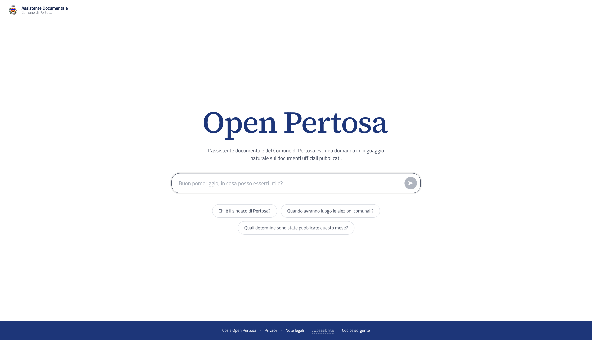

# Open Pertosa

Sistema RAG (Retrieval-Augmented Generation) per la consultazione in linguaggio naturale dei documenti ufficiali del Comune di Pertosa (SA, Italia).

Il progetto nasce come iniziativa civica personale con l'obiettivo di rendere il patrimonio documentale della pubblica amministrazione - bilanci, delibere, determine, regolamenti - accessibile a qualsiasi cittadino senza competenze tecniche o giuridiche.



---

## Il problema

I comuni italiani pubblicano per legge centinaia di documenti all'anno sull'Albo Pretorio, i quali sono formalmente accessibili ma praticamente inaccessibili: sono PDF non indicizzati, spesso scansionati, con un linguaggio tecnico-amministrativo che scoraggia la consultazione autonoma da parte dei cittadini.

Open Pertosa risolve questo problema trasformando l'archivio documentale in una base di conoscenza interrogabile in linguaggio naturale, con risposte citate e verificabili.

---

## Come funziona

```
Domanda del cittadino (italiano)
            ↓
       FastAPI backend
            ↓
   Query rewriting condizionale (LLM, solo se query breve/generica)
            ↓
   Rilevamento intenti temporali (recente, anno, tipo atto, "il più recente")
            ↓
   Hybrid retrieval su Qdrant
        ├── Denso (OpenAI text-embedding-3-small)
        └── Sparso (BM25 italiano via FastEmbed, locale)
            ↓
   Fusione Reciprocal Rank Fusion lato server
            ↓
   Diversificazione per documento (max 2 chunk per fonte)
            ↓
   Top-15 chunk al modello LLM
            ↓
   GPT-4o mini - risposta in streaming SSE
            ↓
   Risposta con citazione delle fonti (link al PDF originale)
```

Il sistema è composto da due pipeline indipendenti.

**Pipeline di ingestion (offline, locale).** I documenti PDF vengono estratti in blocchi tipizzati (paragrafi e tabelle), normalizzati, suddivisi in chunk, arricchiti con contesto generato dall'LLM, vettorizzati in forma duale (densa + sparsa) e indicizzati su Qdrant. L'operazione avviene una volta per documento, offline, sulla macchina dello sviluppatore.

**Pipeline di inferenza (online, server).** Ad ogni domanda del cittadino, la query viene analizzata per intenti temporali, opzionalmente riformulata, vettorizzata nelle due forme, confrontata con i chunk indicizzati, diversificata per documento, e i più rilevanti vengono passati al modello linguistico che genera la risposta in streaming.

---

## Stack tecnologico

| Componente | Tecnologia |
|---|---|
| Backend API | FastAPI + Uvicorn |
| Vector database | Qdrant 1.18+ (self-hosted, Docker) |
| Parsing PDF | PyMuPDF + PyMuPDF4LLM (Markdown per le tabelle) |
| Embedding denso | OpenAI `text-embedding-3-small` |
| Embedding sparso | BM25 italiano via FastEmbed (locale, on-server) |
| Contextual Retrieval | OpenAI `gpt-4o-mini` (arricchimento chunk in ingestion) |
| LLM di risposta | OpenAI `gpt-4o-mini` (streaming SSE) |
| Frontend | HTML/CSS/JS vanilla, font e librerie self-hosted |
| Reverse proxy | Nginx + Let's Encrypt (Certbot) |
| Process manager | systemd |
| Monitoring | Prometheus + Grafana + Node Exporter |
| Infrastruttura | Hetzner Cloud CPX21, Germania (EU) |

**Target produzione:** Azure OpenAI EU (Sweden Central) per conformità GDPR con data residency europea.

---

## Stato del progetto

Il sistema è in **semi-produzione**: live al dominio [open-pertosa.it](https://open-pertosa.it) con HTTPS, ma non ancora adottato ufficialmente dal Comune. Funzionalità operative e infrastruttura sono complete; manca l'integrazione formale come servizio istituzionale e la migrazione delle componenti AI verso Azure OpenAI EU per la piena conformità GDPR.

### Configurazione attuale

| Componente | Configurazione |
|---|---|
| Server | Hetzner CPX21 - 3 vCPU, 4GB RAM, 80GB SSD, Germania |
| Dominio | `open-pertosa.it` |
| HTTPS | Attivo — Let's Encrypt via Certbot |
| LLM | OpenAI API diretta (`gpt-4o-mini`) |
| Embedding denso | OpenAI API diretta (`text-embedding-3-small`) |
| Embedding sparso | BM25 italiano via FastEmbed, in locale sul server |
| Ingestion | Offline sulla macchina dello sviluppatore |

### Configurazione produzione (target)

| Componente | Configurazione |
|---|---|
| Server | Hetzner CPX31 - 4 vCPU, 8GB RAM, 160GB SSD, Germania |
| LLM | Azure OpenAI EU - `gpt-4o-mini`, region Sweden Central |
| Embedding denso | Azure OpenAI EU - `text-embedding-3-small`, region Sweden Central |
| Embedding sparso | BM25 italiano via FastEmbed, in locale sul server (invariato) |
| GDPR | Data Processing Agreement firmato con Microsoft, EU Data Boundary attivo |
| Ingestion | Semi-automatizzata - monitoraggio albo pretorio |

La migrazione richiede l'aggiornamento delle credenziali API da OpenAI a Azure OpenAI EU e la sostituzione dell'istanziazione del client (`OpenAI()` → `AzureOpenAI()` con endpoint ed api_version) nei tre punti in cui viene usato. L'architettura applicativa rimane invariata. L'embedding sparso è già locale e non richiede modifiche.

---

## Struttura del progetto

```
open-pertosa/
├── assets/
│   └── interfaccia.png
├── deployment/
│   └── nginx.conf                   # reverse proxy + HTTPS + serving PDF
├── monitoring/
│   ├── docker-compose.yml           # Prometheus + Grafana + Node Exporter
│   └── prometheus.yml               # scrape targets
├── src/
│   ├── api.py                       # FastAPI: streaming, query rewriting, metriche
│   ├── ingestion/
│   │   ├── parser.py                # PDF → blocchi tipizzati (paragraph | table)
│   │   ├── normalizer.py            # propagazione header tra tabelle multi-pagina
│   │   ├── chunker.py               # chunking per-tipo, header replication
│   │   ├── metadata_extractor.py    # tipo/data/anno: regex filename → testo → LLM
│   │   ├── contextualizer.py        # arricchimento Anthropic-style con LLM
│   │   ├── vectorizer.py            # embedding denso + BM25 + upsert hybrid
│   │   └── run_ingestion.py         # entrypoint pipeline
│   ├── retrieval/
│   │   └── retriever.py             # hybrid RRF, diversificazione, filtri temporali
│   └── frontend/
│       ├── index.html               # chat con streaming e markdown
│       ├── cos-e-open-pertosa.html  # pagina informativa per cittadini
│       ├── og-card.html             # template card OG (Open Graph)
│       ├── fonts.css                # @font-face self-hosted
│       ├── fonts/                   # Titillium Web + Source Serif 4 (woff2)
│       ├── marked.min.js            # markdown renderer self-hosted
│       └── logo-pertosa.png
├── LICENSE                          # GNU AGPL-3.0
├── README.md
├── requirements.txt
└── .gitignore
```

---

## Decisioni di progettazione

### Pipeline di ingestion a stadi con blocchi tipizzati

L'ingestion è organizzata come sequenza lineare di stadi indipendenti che comunicano attraverso un modello-dati canonico:

```
PDF → Parser → Normalizer → Chunker → Contextualizer → Vectorizer → Qdrant
       (blocchi)            (chunk)
```

Il parser produce blocchi del tipo `{type: paragraph | table, content, page, source, header}`. Gli stadi successivi non sanno nulla di PDF, OCR o PyMuPDF: vedono solo blocchi. Cambiare estrattore, modello di embedding o strategia di chunking impatta un solo stadio. Questa è la prima decisione architetturale e quella che rende il sistema manutenibile da una persona sola nel tempo.

### Estrazione PDF con strategia per pagina

I documenti amministrativi italiani presentano formati eterogenei: PDF nativi con testo selezionabile, PDF con OCR sporco (lettere spezzate come `d i` invece di `di`), scansioni pure senza testo incorporato, e — fonte dei guai più difficili — pagine con tabelle complesse a celle unite negli allegati di bilancio.

Il parser decide la strategia pagina per pagina:

1. Se la pagina contiene una tabella "vera" (>= 2 righe e >= 2 colonne, per filtrare i falsi positivi di `find_tables()` su firme e allineamenti) → estrazione in **Markdown** con PyMuPDF4LLM, che preserva la struttura riga/colonna;
2. Altrimenti, se la pagina ha testo nativo → estrazione PyMuPDF nativa, con pulizia regex degli artefatti OCR se necessario;
3. Altrimenti (pagina vuota = scansione pura) → fallback PyMuPDF4LLM con OCR sulla singola pagina.

Ogni pagina è processata indipendentemente: il numero di pagina reale è sempre noto e non viene mai ricalcolato per posizione nella lista di output. Questo elimina per costruzione il bug di disallineamento dei metadati di pagina.

### Tabelle: dalla struttura grafica all'header replication

Le tabelle attraversano tre stadi prima di diventare chunk usabili:

1. **Estrazione in Markdown** (parser): la struttura |riga|colonna| è preservata; un'euristica isola le righe della tabella dal testo discorsivo circostante e identifica le righe di header e separatrice.
2. **Propagazione header tra pagine** (normalizer): una tabella lunga che attraversa più pagine viene estratta dal parser come blocchi separati, perché ogni pagina è processata indipendentemente. Spesso la pagina di continuazione non ripete l'intestazione: il blocco-tabella della pagina successiva sarebbe una sequenza di colonne anonime. Il normalizer presta l'header dalla pagina precedente se il numero di colonne coincide, senza fondere i blocchi (le citazioni restano corrette).
3. **Replicazione header nei chunk** (chunker): se una tabella eccede `chunk_size`, viene spezzata su confini di riga (mai a metà cella) e l'header viene replicato in cima a ogni chunk derivato. Niente overlap tra i pezzi: ogni riga è già autosufficiente grazie all'header replicato.

### Estrazione metadati a cascata

Ogni documento viene etichettato con `tipo_atto`, `data_atto` e `anno`. L'estrazione segue una cascata costo-crescente:

1. **Regex sul nome file** — gratis, deterministico, cattura i pattern strutturati del CMS dell'Albo Pretorio (es. `determinazioni_tec_n._49-2026.pdf`);
2. **Regex sul testo del documento** — gratis, cattura date in formato italiano nella prima/ultima pagina;
3. **LLM su intestazione e calce** — robusto sui casi residui, usato solo quando i primi due step falliscono.

Gli allegati ereditano i metadati dal documento padre tramite un `parent_index` costruito in un pre-scan all'inizio dell'ingestion.

### Contextual Retrieval con doppio testo

Ogni chunk viene arricchito con 2-3 frasi generate dall'LLM che lo situano nel suo documento (tipo di atto, oggetto, anno, informazioni chiave). Il chunk porta da quel momento in poi **due testi**:

- `text` — il frammento originale, quello mostrato all'LLM in fase di risposta e da cui si ricava la citazione del PDF;
- `text_contextualized` — il frammento con il contesto LLM prepended, quello che viene vettorizzato.

Risultato: il retrieval recupera meglio i frammenti privi di contesto autonomo (tipicamente le righe-tabella di un allegato di bilancio, che da sole sono numeri senza referente), ma le citazioni delle fonti restano ancorate al testo originale del documento. Approccio ispirato al [Contextual Retrieval di Anthropic](https://www.anthropic.com/news/contextual-retrieval).

### Hybrid search: denso + BM25 italiano

Il retrieval su Qdrant usa **due vettori per chunk** in una collezione hybrid:

- **Denso** (OpenAI text-embedding-3-small, 1536 dim, cosine): cattura la similarità semantica;
- **Sparso BM25 italiano** via FastEmbed (`language="italian"`, con stemming e stopword italiane), con modificatore IDF lato server: cattura la rilevanza lessicale e penalizza i termini ad alta frequenza.

La fusione dei due ranking avviene server-side con **Reciprocal Rank Fusion** (Qdrant Query API). Motivazione concreta: il termine "Pertosa" compare in ogni documento del corpus e domina gli embeddings densi, spingendo verso l'alto chunk irrilevanti. L'IDF del BM25 lo svaluta al punto da renderlo quasi neutro, lasciando emergere i termini distintivi. L'embedding sparso, essendo locale, non ha implicazioni GDPR né costi API.

### Diversificazione per documento e filtri temporali

Dopo la fusione RRF, due strati di post-processing:

**Diversificazione MMR-light per `source`**: massimo 2 chunk per documento nei risultati finali. Spezza il monopolio dei documenti programmatici lunghi (DUP, PIAO, regolamenti) che altrimenti occupano interamente i top-K con sezioni vicine semanticamente. Politica esplicita: se i candidati diversificati sono meno di top-K si restituiscono meno chunk, anziché ripescare quelli scartati dal limite (vanificherebbe la diversificazione stessa).

**Filtri temporali condizionali**: il modulo di analisi della query rileva:
- `"attualmente"`, `"in corso"`, `"recente"` → filtro `data_atto >= oggi - 180 giorni`;
- `"nel 2024"` (anno singolo) → filtro `anno == 2024`;
- query con anno + termine fiscale (`bilancio`, `rendiconto`, `consuntivo`, `previsione`, ecc.) → **fiscal window** `anno ∈ {N-1, N, N+1}`. Motivo strutturale: nella contabilità pubblica il rendiconto dell'esercizio N viene approvato in N+1 e il bilancio di previsione di N spesso in N-1; un filtro singolo escluderebbe il documento più rilevante.
- `"ultima"`, `"più recente"` + un tipo atto identificato → **percorso dedicato**: bypass totale del retrieval semantico, scroll Qdrant filtrato per `tipo_atto`, ordinamento per `(data_atto, numero_atto)`, restituzione dei chunk del documento vincente. Deterministico, zero costo API, immune al rumore semantico.

Se il filtro temporale azzera i risultati, il sistema ritenta automaticamente senza filtro per non lasciare il cittadino senza risposta.

### Query rewriting condizionale

Le query brevi e generiche (es. "qual è la PEC?") non hanno abbastanza segnali per un retrieval efficace. Il sistema le espande con una chiamata LLM aggiungendo il contesto del Comune. Le query già specifiche (che contengono marker come "Pertosa", "comune", o termini tecnici come "TARI", "delibera") passano intatte. La regola è esplicita per evitare il problema opposto: riscrivere query già precise rischia di spostare gli embeddings lontano dai chunk corretti.

Il modello vede sempre la **domanda originale** del cittadino, non quella riformulata: la risposta resta in linea col tono di chi ha chiesto. La riformulazione viene usata solo per il retrieval.

### Iniezione della data odierna nel system prompt

Il system prompt include la data corrente, così il modello può interpretare correttamente espressioni come "attualmente", "ultimo mese", "recente" rispetto ai documenti recuperati. Combinato con i filtri temporali nel retriever, questo permette domande naturali sul presente senza richiedere all'utente di specificare l'anno.

### Streaming SSE con typewriter adattivo

Le risposte vengono trasmesse token per token via Server-Sent Events. Il frontend implementa un buffer di caratteri con un loop a 60fps che regola dinamicamente la velocità di rendering in base alla dimensione del buffer — più lento quando il buffer è piccolo, più veloce quando si accumula un arretrato. Il risultato è uno scorrimento visivamente fluido indipendentemente dalla latenza irregolare del modello.

### Citazioni cliccabili e pannello PDF inline

Il system prompt impone al modello di citare ogni fonte nel formato `(Fonte: nomefile.pdf, pagina N)`, copiando il nome del file **carattere per carattere** dall'header del chunk fornito. Il frontend rileva queste citazioni nel Markdown grezzo (prima del rendering, dove la sintassi è prevedibile) e le trasforma in link che aprono un pannello PDF stile iOS sheet, posizionato direttamente sulla pagina citata. Il pannello è drag-to-dismiss, supporta ESC e tap sull'overlay.

### Memoria della conversazione

La cronologia della conversazione viene mantenuta in memoria nel browser (non persistita) e inviata ad ogni richiesta API. Il system prompt istruisce il modello a distinguere tra domande fattuali (rispondi solo dai documenti) e domande di follow-up (puoi usare il contesto della conversazione). La cronologia è limitata agli ultimi 20 messaggi per contenere la dimensione del contesto.

### Frontend senza dipendenze esterne

Font (Titillium Web, Source Serif 4) e librerie (marked.js) sono **self-hosted** dalla stessa origine. La Content Security Policy del frontend è limitata a `'self'`: niente Google Fonts, niente CDN. Vantaggi concreti: privacy del cittadino (nessuna richiesta a terzi che permetta tracking), affidabilità (il servizio funziona anche se CDN esterni cadono), conformità GDPR per la parte frontend.

---

## Setup locale

### Prerequisiti

- Python 3.11+
- Docker
- API key OpenAI

### Installazione

```bash
git clone https://github.com/marinoalfonso/open-pertosa.git
cd open-pertosa

python3 -m venv .venv
source .venv/bin/activate
pip install -r requirements.txt
```

### Configurazione

Crea un file `.env` nella root del progetto:

```env
OPENAI_API_KEY=sk-...
OPENAI_EMBEDDING_MODEL=text-embedding-3-small
OPENAI_CONTEXT_MODEL=gpt-4o-mini
OPENAI_EXTRACT_MODEL=gpt-4o-mini
QDRANT_HOST=localhost
QDRANT_PORT=6333
```

### Avvio

```bash
# Qdrant
docker run -d --name qdrant --restart always \
  -p 6333:6333 \
  -v $(pwd)/qdrant_storage:/qdrant/storage \
  qdrant/qdrant

# Ingestion: posiziona i PDF in data/raw/ e indicizza.
# La prima ingestion ricrea la collezione hybrid (denso + BM25).
cd src/ingestion
python run_ingestion.py

# Server API
cd ../..
uvicorn src.api:app --reload --port 8000

# Frontend (apri index.html nel browser)
open src/frontend/index.html
```

### Monitoring (opzionale)

```bash
cd monitoring
docker compose up -d
```

Grafana è accessibile via tunnel SSH per non esporlo pubblicamente:

```bash
ssh -L 3000:localhost:3000 root@<server-ip>
# poi: http://localhost:3000 (credenziali in monitoring/.env)
```

---

## Deploy su Hetzner

```bash
# Dipendenze di sistema
apt update && apt upgrade -y
apt install -y python3-pip python3-venv nginx certbot python3-certbot-nginx
curl -fsSL https://get.docker.com | sh

# Progetto
git clone https://github.com/marinoalfonso/open-pertosa.git /opt/pertosa-rag
cd /opt/pertosa-rag
python3 -m venv .venv
source .venv/bin/activate
pip install -r requirements.txt

# Qdrant
docker run -d --name qdrant --restart always \
  -p 6333:6333 \
  -v /opt/pertosa-rag/qdrant_storage:/qdrant/storage \
  qdrant/qdrant

# Systemd service per uvicorn → /etc/systemd/system/pertosa-rag.service
# Nginx vhost                → /etc/nginx/sites-available/open-pertosa
# HTTPS                      → certbot --nginx -d open-pertosa.it
```

Una configurazione Nginx di riferimento è disponibile in `deployment/nginx.conf`.

---

## Limitazioni note

| Problema | Stato |
|---|---|
| Vocabolario citizen vs. amministrativo | Limitazione strutturale — query molto astratte ("opere pubbliche") possono non allinearsi con la terminologia concreta dei documenti ("determina di affidamento lavori"). Riformulazioni più concrete risolvono nella maggior parte dei casi. |
| Aggregazione temporale dello stato di un lavoro | Il sistema non ha nozione esplicita dello stato corrente di un procedimento: legge gli atti più recenti e dichiara la data di riferimento, suggerendo di rivolgersi agli uffici per conferma. |
| Data residency EU (GDPR formale) | Pianificata la migrazione ad Azure OpenAI EU. Codice client già predisposto per il cambio; in attesa della procurazione lato Comune. |

---

## Licenza

Rilasciato sotto licenza **GNU Affero General Public License v3.0 (AGPL-3.0)**, coerente con la licenza della dipendenza PyMuPDF.

---

## Autore

**Alfonso Marino**
[github.com/marinoalfonso](https://github.com/marinoalfonso)